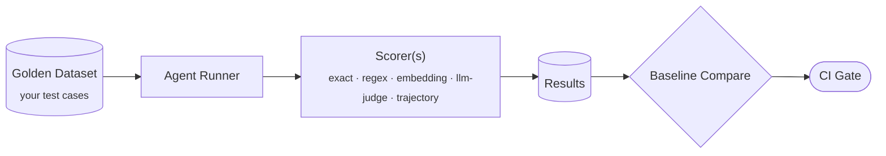
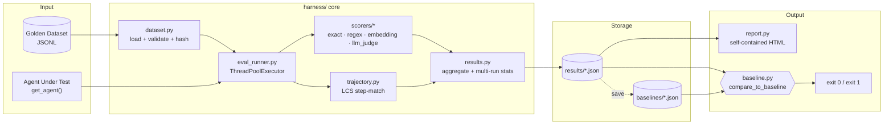
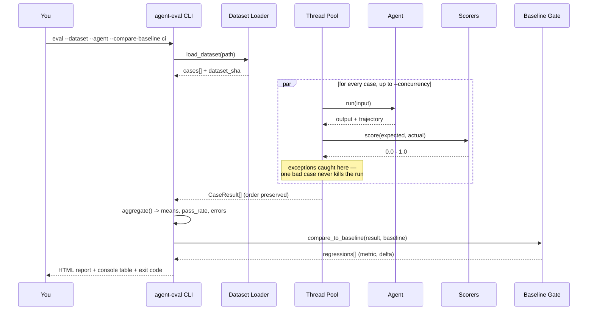
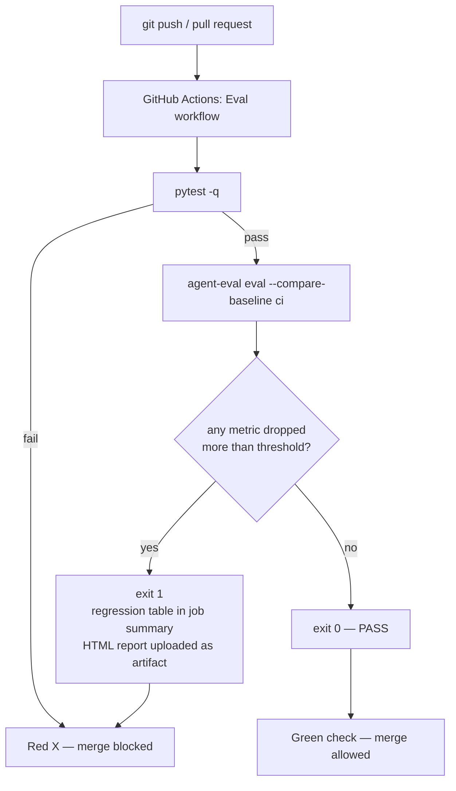
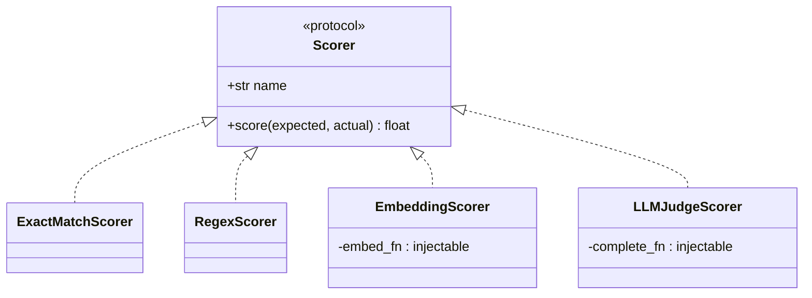

<div align="center">

# Lowq X1

### Agent Eval Harness

[](https://github.com/kshubham090/Agent-Eval-Harness/actions/workflows/eval.yml)
[](https://github.com/kshubham090/Agent-Eval-Harness/actions/workflows/real-eval.yml)
[](pyproject.toml)
[](tests/)
[](https://github.com/kshubham090/Agent-Eval-Harness/commits/master)

**A production-grade eval system for AI agents, built from scratch — no eval frameworks.**

</div>

---



The harness answers one question: **"Is my agent getting better or worse?"**
And it blocks deploys when the answer is "worse."

## Features

- **Pluggable scorers** — exact match, regex, embedding similarity (sentence-transformers), and LLM-as-judge (Anthropic API), all implementing one `Scorer` protocol (0.0–1.0)
- **Trajectory scoring** — LCS-based comparison of the agent's tool-call sequence against the expected one; order matters, extra and missing steps both cost points
- **Regression gate** — save a baseline from a known-good run; any metric dropping more than a threshold fails the run with exit code 1, wired into GitHub Actions
- **Concurrency** — cases run in a thread pool (`--concurrency 8`); agents and LLM scorers are I/O-bound
- **Failure isolation** — one crashing case records an error and scores 0.0; the run continues
- **Multi-run statistics** — `--runs 3` reports mean ± std per metric, so you gate on signal, not single-run noise
- **Dataset fingerprinting** — results carry a content hash of the dataset; the gate refuses to compare runs from different dataset versions (including tag-filtered subsets)
- **HTML reports** — `--html report.html` writes a self-contained page: metrics, baseline deltas, and every case worst-first with expected vs actual, latency, and errors
- **Meta-eval** — calibrate the LLM judge against human-graded cases and measure its agreement before trusting its scores
- **CI-native** — regression tables land in the GitHub Actions job summary; the HTML report uploads as an artifact

## System Design & Architecture

### Component architecture

How the pieces fit together — a dataset and an agent go in, a pass/fail decision comes out.



### Eval run — process flow

What happens inside a single `agent-eval eval` invocation.



### CI regression gate

The whole point of the project: an automatic, unbypassable check on every push.



### Scorer plugin model

Every scorer implements one protocol, so adding a new grading strategy never touches the eval loop.



`embed_fn` and `complete_fn` are why the test suite runs offline in seconds and
why swapping in Ollama as the judge backend is a one-function change, not a
rewrite.

## Datasets included

| Dataset | Cases | What it covers |
|---|---|---|
| [simple_qa.jsonl](datasets/examples/simple_qa.jsonl) | 60 | Factual Q&A across geography, science, math, history, literature, technology, sports — every case tagged for `--filter-tags` slicing |
| [tool_calling.jsonl](datasets/examples/tool_calling.jsonl) | 18 | Multi-step trajectories across travel, finance, email, calendar, devops, shopping, support |
| [judge_calibration.jsonl](datasets/examples/judge_calibration.jsonl) | 40 | Human-graded pairs covering paraphrases, numeric formats, abbreviations, hedged answers, descriptions-without-naming, extra info, contradictions |

## Quickstart

```bash
git clone https://github.com/kshubham090/Agent-Eval-Harness.git
cd Agent-Eval-Harness
python -m venv .venv
.venv/Scripts/activate            # Windows; on Unix: source .venv/bin/activate
pip install -e .[dev]
pytest -q                         # 96 tests
```

Run your first eval (a stub agent that always answers "Paris"):

```bash
agent-eval eval --dataset datasets/examples/simple_qa.jsonl \
    --agent examples/stub_agent.py --scorers exact \
    --output results/run_001.json --html results/report.html
```

Save it as a baseline, then watch the gate catch a regression:

```bash
agent-eval baseline save --name v1.0 --result results/run_001.json

# degraded agent answers "London" to everything -> exit code 1
agent-eval eval --dataset datasets/examples/simple_qa.jsonl \
    --agent examples/degraded_agent.py --scorers exact \
    --compare-baseline v1.0 --threshold 0.01
```

### Evaluate a real agent

The stub agents above are deterministic fixtures for exercising the harness.
The real workflow evaluates a model-backed agent — put your key in `.env`
(copy [.env.example](.env.example)) and run:

```bash
pip install -e .[judge,embedding]
agent-eval eval --dataset datasets/examples/simple_qa.jsonl \
    --agent examples/claude_agent.py \
    --scorers exact,embedding,llm_judge \
    --concurrency 2 \
    --output results/claude.json --html results/claude.html
```

The committed [baselines/claude-v1.json](baselines/claude-v1.json) is a real
run of this agent on the full 60-case dataset — gate your changes against it
with `--compare-baseline claude-v1`. In CI, the
[real-agent eval workflow](.github/workflows/real-eval.yml) runs the same
thing on demand (Actions → "Real-agent eval" → Run workflow) once you add an
`ANTHROPIC_API_KEY` repository secret.

Actual results from that run — a live demonstration of why the scorer ladder
exists:

| Metric | Mean | What it says |
|---|---|---|
| exact_match | 0.867 | 8/60 answers differ only in formatting ("Six" vs "6", "Sir Arthur Conan Doyle", "H₂O" vs "H2O") |
| embedding | 0.984 | rescues 7 of those 8 — but scores H₂O vs H2O only 0.48 (the subscript breaks tokenization) |
| llm_judge | 1.000 | correctly grades all 60 as right |
| pass_rate | 0.983 | |

Same agent, three verdicts. Exact match under-reports by 13 points, embeddings
have blind spots of their own, and the (calibrated) judge gets it right —
which is why you calibrate it first.

## CLI reference

```
agent-eval eval
  --dataset PATH              JSONL golden dataset (required)
  --agent PATH                Python file exposing get_agent() (required)
  --scorers NAMES             comma-separated: exact,regex,embedding,llm_judge  [exact]
  --concurrency N             cases run in parallel  [4]
  --runs N                    repeat N times, report mean +/- std  [1]
  --filter-tags TAGS          only run cases carrying at least one tag
  --output PATH               write result JSON
  --html PATH                 write self-contained HTML report
  --compare-baseline NAME     gate against a saved baseline (exit 1 on regression)
  --threshold FLOAT           max allowed absolute drop per metric  [0.05]
  --allow-dataset-change      compare even if the dataset changed since the baseline

agent-eval baseline save --name NAME --result PATH
agent-eval baseline list
```

`python -m harness ...` works identically.

## Writing an agent

An agent is any Python file exposing `get_agent()` returning an object with
`run(input: str) -> AgentOutput`:

```python
from harness.runner import AgentOutput

class MyAgent:
    def run(self, input: str) -> AgentOutput:
        answer, steps = my_pipeline(input)
        return AgentOutput(output=answer, trajectory=steps)  # trajectory optional

def get_agent():
    return MyAgent()
```

Included examples:

| File | What it is |
|---|---|
| [examples/stub_agent.py](examples/stub_agent.py) | Deterministic fixture (always "Paris") for testing the harness |
| [examples/degraded_agent.py](examples/degraded_agent.py) | Deliberately worse fixture for demoing the gate |
| [examples/claude_agent.py](examples/claude_agent.py) | Real agent on the Anthropic API (`AGENT_MODEL` to override) |
| [examples/ollama_agent.py](examples/ollama_agent.py) | Local agent via Ollama — zero API cost (`OLLAMA_MODEL` to override) |

## Datasets

JSONL, one case per line. Output-only case:

```json
{"id": "q1", "input": "What is the capital of France?", "expected_output": "Paris", "tags": ["geography"]}
```

Trajectory case (the agent should take these steps, in order):

```json
{"id": "t1", "input": "Book a flight from NYC to London", "expected_output": "Flight booked",
 "expected_trajectory": ["search_flights", "select_cheapest", "confirm_booking"], "tags": ["tool-use"]}
```

The loader validates everything loudly: required fields, types, duplicate ids,
unknown fields — with line numbers in every error.

## Scorers

| Scorer | Measures | Cost | Use when |
|---|---|---|---|
| `exact` | strict string equality (after strip) | free | answers are canonical ("4", "Paris") |
| `regex` | `expected_output` as a pattern vs output | free | asserting shape ("contains a YYYY-MM-DD date") |
| `embedding` | cosine similarity of sentence embeddings | free, local model | paraphrases should count ("The capital is Paris") |
| `llm_judge` | model-graded correctness (0.0–1.0 + reasoning) | ~$0.001/case (Haiku) | quality is subjective or nuanced |

Trajectory scoring runs automatically for any case with `expected_trajectory`.

Extras install per scorer: `pip install -e .[embedding]` (sentence-transformers),
`pip install -e .[judge]` (anthropic — put `ANTHROPIC_API_KEY` in `.env`, see
[.env.example](.env.example)).

## The regression gate in CI

[.github/workflows/eval.yml](.github/workflows/eval.yml) runs on every push and PR:
tests first, then the eval against the committed baseline in [baselines/](baselines/).
A regression fails the check, posts a metric table to the job summary, and uploads
the HTML report as an artifact.

Update the baseline intentionally (after verifying an improvement):

```bash
agent-eval eval --dataset ... --agent ... --output results/new.json
agent-eval baseline save --name ci --result results/new.json
git add baselines/ci.json && git commit -m "Raise eval baseline"
```

## Trusting the judge (meta-eval)

An LLM judge has biases; measure them before believing its scores.
[datasets/examples/judge_calibration.jsonl](datasets/examples/judge_calibration.jsonl)
holds human-graded `(expected, actual, human_score)` triples;
[scripts/calibrate_judge.py](scripts/calibrate_judge.py) reports each judge's mean
absolute error and agreement rate against the humans:

```
exact match as judge:   agreement 40%   MAE 0.53
LLM judge (Haiku):      agreement 90%   MAE 0.05   (after rubric tuning)
```

The loop: calibrate → find the bias pattern (e.g. penalizing extra correct info)
→ tune the rubric in [harness/scorers/llm_judge.py](harness/scorers/llm_judge.py)
→ re-calibrate. Grow the calibration set before chasing the last few percent, or
you're overfitting to it.

## Project structure

```
harness/
├── dataset.py          # JSONL loading + validation, tags filter, content hash
├── runner.py           # AgentRunner protocol + AgentOutput
├── scorers/
│   ├── base.py         # Scorer protocol (0.0–1.0 contract)
│   ├── exact.py        # exact string match
│   ├── regex_scorer.py # pattern assertions
│   ├── embedding.py    # cosine similarity (pluggable embed_fn)
│   └── llm_judge.py    # LLM-as-judge (pluggable backend, calibrated rubric)
├── trajectory.py       # LCS-based step-sequence scoring
├── eval_runner.py      # the loop: concurrency, failure isolation, latency
├── results.py          # result models, aggregation, multi-run statistics
├── baseline.py         # save/load/compare with dataset fingerprint check
├── report.py           # self-contained HTML report
├── meta_eval.py        # judge calibration against human grades
└── cli.py              # agent-eval / python -m harness
```

Design decisions worth knowing:

- **Everything heavy is pluggable.** `EmbeddingScorer(embed_fn=...)` and
  `LLMJudgeScorer(complete_fn=...)` accept plain functions, so the entire test
  suite runs offline in seconds, and swapping providers (e.g. Ollama as judge)
  is one function.
- **Errored cases score 0.0 and count** against every mean — an agent that
  crashes is a worse agent, and the gate should see that.
- **A case "passes"** when the mean of its scores (including trajectory) is
  ≥ 0.5 (tunable via `run_eval(pass_threshold=...)`).

## Roadmap

- Agent-output caching (re-score stored outputs without re-running the agent)
- Confidence-interval gating (compare distributions, not point means)
- Batch API backend for the judge (50% cheaper at scale)
- Judge ensembles / median-of-3 for grading stability
- `harness init` scaffolding command

## How it was built

This project was built as a learning exercise in nine phases — each one concept:
dataset → eval loop → regex → embeddings → LLM-as-judge → trajectories →
baselines → CI wiring → meta-eval. Learning resources for each concept:
[RESOURCES.md](RESOURCES.md).
