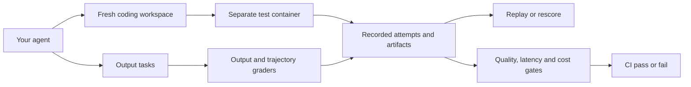

<div align="center">

# Agent Eval Harness

**Bring your agent. Test its answers and code. Keep the evidence.**

[](https://github.com/kshubham090/Agent-Eval-Harness/actions/workflows/eval.yml)
[](pyproject.toml)
[](LICENSE)

Codex · Claude Code · Python functions · any command · HTTP services

</div>

Evaluate the agent you already have, using your own tasks and existing login.
Keep results locally, inspect every answer, and fail CI when quality drops.
The core needs only Click and python-dotenv; model-based scorers are optional.
There is no evaluation service account or framework migration.

| Workflow | What you get |
| --- | --- |
| Existing-agent evaluation | Python, command, HTTP, Codex and Claude Code adapters |
| Repository repair | Fresh Docker workspaces, separate test grading, candidate archives and patches |
| Versioned task packs | Bundled starters, strict manifests, full content fingerprints and authoring tools |
| Replay and rescore | Inspect saved attempts or apply new output graders without calling the agent again |
| CI acceptance | Quality, error, latency and reported-cost gates; a reusable GitHub Action |
| Open source | Apache-2.0, local artifacts, lightweight core and documented contribution/release paths |

## First result in three commands

From a Python 3.12+ environment:

```sh
python -m pip install "git+https://github.com/kshubham090/Agent-Eval-Harness.git"
agent-eval init my-evals
agent-eval eval --config my-evals/agent-eval.toml
```

Open `my-evals/results/report.html`. You now have an editable configuration,
three test cases, a JSON result, and a standalone HTML report. The starter
agent is a deterministic arithmetic fixture, so this costs no model tokens.
Replace it with your own agent and tasks.

For development:

```sh
git clone https://github.com/kshubham090/Agent-Eval-Harness.git
cd Agent-Eval-Harness
python -m venv .venv
# macOS/Linux: source .venv/bin/activate
# Windows PowerShell: .venv\Scripts\Activate.ps1
python -m pip install -e ".[dev]"
python -m pytest -q
```

## Evaluate working code end to end

The `coding` workflow gives each task a fresh workspace, runs your agent, freezes
its edits, and copies the candidate into a **separate grading container**. Test
files are withheld from the agent's runtime workspace. Every task produces
bounded logs, a candidate archive, file hashes and a patch alongside its score.

Try the entire pipeline without a provider account, from this checkout:

```sh
docker build -f examples/Dockerfile.fixture -t agent-eval-fixture:local .
agent-eval coding --pack coding-starter@1.0.0 \
  --image agent-eval-fixture:local --command '["python", "/opt/fixture_agent.py"]' \
  --output results/coding.json --html results/coding.html --min-pass-rate 1
agent-eval replay --result results/coding.json --html results/coding-replay.html
```

This fixture applies known solutions to three teaching tasks; it is **not an AI
model benchmark**. Add `--noop` to its command array to leave the bugs intact and
observe the quality gate fail. Replace the image and command with your own
agent. Its command reads the prompt from stdin and edits `/workspace`.

Containers use a read-only root filesystem, a non-root user and bounded
resources. Agent networking defaults to off; graders always have no network.
Provider access requires explicit networking and named credential variables.
Docker and the selected image are trusted; these controls do not establish
security against hostile code. [Coding guide and exact limits →](docs/coding.md)

## Packs, replay and new graders

```sh
agent-eval pack list
agent-eval pack inspect coding-starter@1.0.0
agent-eval pack init my-pack --kind coding
agent-eval eval --pack json-contracts@1.0.0 --agent my_agent.py::answer \
  --output results/answers.json
agent-eval rescore --result results/answers.json --scorers json,exact \
  --output results/rescored.json --html results/rescored.html
```

Packs ship in the installed wheel and can also live in your repository. A pack's
fingerprint covers its manifest, tasks, starter files and graders. Published
versions should be immutable. [Pack format and contribution guide →](docs/packs.md)

Replay validates and renders recorded evidence. Rescoring preserves the original
answers, available tool events, agent timing, usage and cost while recording the
new grader configuration and time separately. Agent failures remain failures;
failed output graders can be retried. Coding results can be replayed, but cannot
be regraded as text. [Recording and rescore semantics →](docs/replay.md)

## Connect your existing agent

These examples run from this repository using the included
[16-case JSON smoke suite](benchmarks/agent_smoke.jsonl). It checks Python
tracing, data transformations, algorithms and response constraints. It is an
authored smoke test, not a coding leaderboard or an industry benchmark.

```sh
# Codex: uses your installed CLI and existing authentication.
agent-eval eval --agent codex --cwd /path/to/your/repository \
  --dataset benchmarks/agent_smoke.jsonl --scorers json \
  --output results/codex.json --html results/codex.html

# Claude Code: uses your installed CLI and existing authentication.
agent-eval eval --agent claude-code --cwd /path/to/your/project \
  --dataset benchmarks/agent_smoke.jsonl --scorers json \
  --output results/claude-code.json --html results/claude-code.html

# Your existing sync or async Python function.
agent-eval eval --agent my_agent.py::answer --dataset cases.jsonl

# Any language: stdin contains the prompt; stdout contains the answer.
agent-eval eval --command '["node", "my-agent.mjs"]' --dataset cases.jsonl

# Your existing service: POST {"input": "..."}, receive {"output": "..."}.
agent-eval eval --url http://localhost:8000/agent --dataset cases.jsonl
```

Use `agent-eval init evals --agent codex` (or `claude-code`, `command`, `http`,
`python`) for a starter configuration. `agent-eval doctor` checks optional
CLI availability without making a model call. Add `--model YOUR_MODEL` to
choose a model explicitly; otherwise each CLI uses its own configuration.

| Connection | What you provide | Captured automatically |
| --- | --- | --- |
| Codex | Installed, authenticated `codex` | Final answer, reported tokens, supported completed tool events |
| Claude Code | Installed, authenticated `claude` | Final answer, reported tokens and USD cost |
| Command | An argv array | stdout; optional JSON answer, events, trajectory, usage and cost |
| HTTP | A JSON endpoint | Answer; optional events, trajectory, usage and cost |
| Python | Function or original `get_agent()` factory | Text, `AgentOutput`, or JSON envelope |

[Integration guide →](docs/integrations.md) Includes authentication, custom
arguments, framework bridges, request/response contracts and permissions.

## What you can measure

- **Quality:** exact match, regex, substring assertions, structural JSON
  equality, optional embeddings and an optional LLM judge.
- **Tool order:** compare expected tool sequences with observed trajectories
  using a longest-common-subsequence score.
- **Reliability:** preserve every attempted case, its output and errors.
  Crashes and scorer failures score zero and never count as passes.
- **Latency and usage:** per-case agent and scoring latency, p50/p95/p99,
  reported tokens and agent cost, with explicit coverage for missing data.
- **Dataset slices:** pass rates, scores and errors by tag, alongside overall
  results. Hard cases cannot disappear into an aggregate average.
- **Repeated runs:** means and sample standard deviations across runs, plus a
  per-run Wilson interval with its sampling assumptions recorded.
- **Regression gates:** dataset fingerprints, scoring-protocol checks,
  missing-metric detection, minimum pass rates and failing CI exit codes.
- **Evidence:** versioned JSON, escaped standalone HTML, all repeated-run case
  details, and offline report generation from saved results.


```mermaid
flowchart LR
    A[Your agent] --> O[Output tasks]
    A --> C[Fresh coding workspace]
    C --> T[Separate test container]
    O --> S[Output and trajectory graders]
    T --> R[Recorded attempts and artifacts]
    S --> R
    R --> P[Replay or rescore]
    R --> G[Quality, latency and cost gates]
    G --> CI[CI pass or fail]
```

Concurrency defaults to one. Increase `--concurrency` for independent,
thread-safe workloads; use `--runs` to repeat stochastic evaluations. The
harness sends only task inputs to agents, not reference answers.

## Reproducible benchmarks

The repository includes two different measurements: real Docker workflow
validation using known patches, and controlled harness-throughput measurements.
Neither ranks model intelligence.

<!-- CODING_BENCHMARK_RESULTS_START -->
**Real Docker workflow:** 3 interleaved repetitions of 3 tasks per fixture,
with fresh agent/grader containers and no network.

| Fixture | Passed task attempts | Execution errors | Median batch | Batch p95 |
| --- | ---: | ---: | ---: | ---: |
| Known reference patches | 9/9 | 0 | 3.00 s | 3.05 s |
| Unchanged buggy starters | 0/9 | 0 | 2.85 s | 3.23 s |

Timing includes provisioning, transfers, execution, grading and cleanup. No
warmup is excluded; p95 is the maximum of three trials. These are known patches,
not model-generated solutions. Token use and cost are unreported.

Measured **2026-10-04** on macOS arm64 with Docker **29.7.2**, from clean source [`8a3adb5`](https://github.com/kshubham090/Agent-Eval-Harness/commit/8a3adb57a46bc8cabfcc872a3f83c0853c5a0dc4). All four workflow checks passed.

[All raw task attempts and hashes](benchmarks/coding-latest.json) · [Full Docker tables](benchmarks/coding-latest.md)
<!-- CODING_BENCHMARK_RESULTS_END -->

Reproduce the coding measurement after building the fixture image above:

```sh
python scripts/benchmark_coding.py --image agent-eval-fixture:local \
  --output benchmarks/coding-latest.json --markdown benchmarks/coding-latest.md
```

The raw evidence retains every task result and trial, Docker/image identity,
pack/source hashes, and the known fixture command. The three tasks contain 85
checks; each task receives one binary pass/fail score. Three authored tasks
are too small to support a general coding-agent ranking.

**These are measured harness operations, not model intelligence scores.**
The benchmark uses a deterministic calculator and controlled waiting. It
makes no model calls and does not compare against other evaluation frameworks.

<!-- BENCHMARK_RESULTS_START -->
Measured **2026-10-04**, macOS arm64, Python 3.14.7, 10 logical CPUs, from clean source revision [`8a3adb5`](https://github.com/kshubham090/Agent-Eval-Harness/commit/8a3adb57a46bc8cabfcc872a3f83c0853c5a0dc4).

**Controlled waiting:** 128 arithmetic tasks per batch; 5 ms requested wait per task; 1 warmup excluded and 5 measured repetitions per level.

| Concurrency | Median batch | P95 batch | Median cases/s | Speedup |
| ---: | ---: | ---: | ---: | ---: |
| 1 | 780.53 ms | 784.84 ms | 164.0 | 1.00× |
| 2 | 390.83 ms | 401.85 ms | 327.5 | 2.00× |
| 4 | 194.05 ms | 199.78 ms | 659.6 | 4.02× |
| 8 | 99.61 ms | 100.79 ms | 1285.0 | 7.84× |

P95 is the nearest-rank quantile of five batch samples (the maximum here).
This demonstrates overlapping controlled waiting, not real provider throughput.

**No-wait overhead:** 4,096 serial tasks took a median **26.99 ms** in the full harness versus **2.79 ms** in a direct calculator/scorer loop. The median paired difference was **5.92 µs per case**.

**Functional checks: 9/9 passed.** The correct fixture scored 100%; a deliberately degraded fixture scored 75% and failed the regression gate. Injecting 32/128 crashes preserved all cases and scored the errors zero.

[Raw samples and source hashes](benchmarks/latest.json) · [Full measured tables](benchmarks/latest.md)
<!-- BENCHMARK_RESULTS_END -->

Reproduce from the checkout:

```sh
python scripts/benchmark.py \
  --output benchmarks/latest.json --markdown benchmarks/latest.md
```

The JSON contains warmups and raw measured samples, dataset and source
fingerprints, command, UTC timestamps, Git revision/dirty status, Python,
OS and CPU count. The benchmark fails if a functional check fails; CI does
not enforce machine-dependent speed thresholds.

[Methodology and limitations →](docs/benchmarking.md)

**Live-agent status:** no new authenticated Codex or Claude Code benchmark was
run for this change. The validation machine had Codex CLI 0.160.0 without a
login and no Claude Code executable. Both adapters have offline protocol and
process tests. The included smoke suite and commands above let you measure
your own configured agents without inventing a leaderboard.

The older [Claude snapshot](baselines/claude-v1.json) is retained as historical
example data. It lacks enough model, prompt and environment provenance for a
reproducible comparison; its three scorer means are not three competing
agents. [Provenance audit →](docs/benchmarking.md#historical-baseline-provenance)

## Gate changes in your repository

Use the included [GitHub Action](action.yml) with a reviewed commit pinned in
your workflow, or enforce the same gates locally:

```sh
agent-eval gate --result results/answers.json --min-pass-rate 0.95 \
  --max-p95-latency-ms 30000 --output results/gates.json
# When every case reports agent cost, also add --max-cost-usd 2.00.
```

The action checks quality and latency in every run and total reported agent
cost across all runs. Required but missing measurements fail the gate. These
are checks after execution, not spending caps. Reports and failed-case evidence
are retained when a gate fails. [Action setup and gate definitions →](docs/ci.md)

Apache-2.0 licensed. [Contribute](CONTRIBUTING.md) · [Security](SECURITY.md) ·
[Release procedure](docs/releases.md) · [Changelog](CHANGELOG.md).
Release automation is included; this change does not publish a PyPI release.

## Configuration you can commit

```toml
# agent-eval.toml — paths are relative to this file
[agent]
type = "codex"
cwd = "/path/to/your/repository"
timeout = 120
# model = "your-model"

[eval]
dataset = "cases.jsonl"
scorers = ["json"]
concurrency = 1
runs = 3
pass_threshold = 1.0
min_pass_rate = 0.95

[output]
json = "results/run.json"
html = "results/report.html"
```

Run `agent-eval eval --config agent-eval.toml`. Command-line options override
configuration. Unknown sections and misspelled keys fail early. Keep tokens
in environment variables; HTTP config accepts `token_env = "MY_AGENT_TOKEN"`.

A dataset is JSONL, with one object per line:

```json
{"id":"sum","input":"Return only JSON: the sum of 17 and 25.","expected_output":"42","tags":["arithmetic"]}
{"id":"route","input":"Return only JSON with city Paris and country France.","expected_output":"{\"city\":\"Paris\",\"country\":\"France\"}","tags":["structured"]}
```

`id`, `input` and `expected_output` are required strings. Optional `tags`
select slices with `--filter-tags structured`; optional `expected_trajectory`
is an array of tool names. Duplicate IDs, unknown fields and malformed data
are rejected before execution. Check a dataset without running any agent:

```sh
agent-eval validate --dataset cases.jsonl
```

| Scorer flag | Contract | Extra dependency |
| --- | --- | --- |
| `exact` | String equality after trimming outer whitespace | None |
| `json` | Parsed JSON equality; ignores object key order, preserves array order and boolean types | None |
| `contains` | Case-sensitive substring present in answer | None |
| `regex` | `expected_output` is a regex searched in the answer | None |
| `embedding` | Cosine similarity of sentence embeddings | `pip install ".[embedding]"` |
| `llm_judge` | Anthropic-backed rubric grade; backend can be replaced | `pip install ".[judge]"` |

Choose a scorer whose contract matches the reference format. Mixing `exact`
and `regex` uses the same reference as both literal text and a pattern.
By default a case passes at mean score ≥ 0.5 across selected scorers and its
trajectory score, if present. Set `--pass-threshold 1.0` when every assertion
must pass. LLM grades and similarity scores are imperfect proxies; calibrate
judges against held-out human labels before relying on them.

## Gate changes in CI

```sh
# Establish a reviewed baseline.
agent-eval eval --config agent-eval.toml --output results/baseline.json
agent-eval baseline save --name production --result results/baseline.json

# Fail on errors, low pass rate, or more than a 2-point metric drop.
agent-eval eval --config agent-eval.toml \
  --compare-baseline production --threshold 0.02 --min-pass-rate 0.95

# Compare or render existing evidence without another model call.
agent-eval compare --current results/new.json --baseline results/baseline.json
agent-eval report --result results/new.json --html results/new.html
```

A threshold of `0.02` means two percentage points, not a 2% relative drop.
Errors fail the CLI by default; `--allow-errors` disables that exit condition
but keeps failed cases in all metrics. Repeated-run gates use mean quality
metrics, not a claim of statistical significance. Confidence intervals are
not used to auto-approve regressions. Legacy baselines without protocol
metadata remain readable; regenerate them to get stricter checks.

Version 0.2 preserves the original Python factory contract and legacy baseline
format. Two defaults change: concurrency is now 1 (previously 4), and case
errors now exit with status 1 even without a baseline.

The [CI workflow](.github/workflows/eval.yml) runs offline tests and first-use
checks on Linux, macOS and Windows, builds the wheel, checks the original
baseline, and exercises deterministic benchmark invariants. No API key is
needed. Require the check in branch protection if merges must be blocked.
The optional [real-agent workflow](.github/workflows/real-eval.yml) runs the
Anthropic example manually with a repository secret.

## Scope and practical limits

This release evaluates text/JSON responses and supplied tool trajectories.
It does not yet provision per-case containers, reset repositories, verify
patches with hidden tests, or run SWE-bench/Terminal-Bench. A prompt-only score
cannot establish end-to-end coding ability or “best in the world.”

The Codex preset starts read-only; Claude Code uses `dontAsk` and retains
existing tool permissions. Command and Python integrations use your existing
environment. Mutable agents need isolated workspaces or sequential execution.
Subprocess timeouts include output draining; POSIX descendants are cleaned
up, while Windows terminates only the direct child. HTTP uses a socket
timeout. In-process Python functions have no enforced timeout.

Usage totals only include what agents report; missing usage is unknown.
Optional model-based scorer costs are not included. Wilson intervals assume
independent, representative cases and do not measure model variation across
runs. Benchmark numbers vary with hardware, runtime and background load.

## Extend the harness

A custom runner implements `run(input: str) -> AgentOutput`. A custom scorer
implements `name` and `score(expected: str, actual: str) -> float` in `[0, 1]`.
They can be supplied directly to `harness.eval_runner.run_eval`. Existing
factory agents remain compatible.

See [integration examples](docs/integrations.md), [benchmark methodology](docs/benchmarking.md),
[smoke-suite generation](benchmarks/README.md), and the original
[learning resources](RESOURCES.md). Next priorities are reproducible sandboxed
coding tasks, resumable runs and richer task-specific validators.
